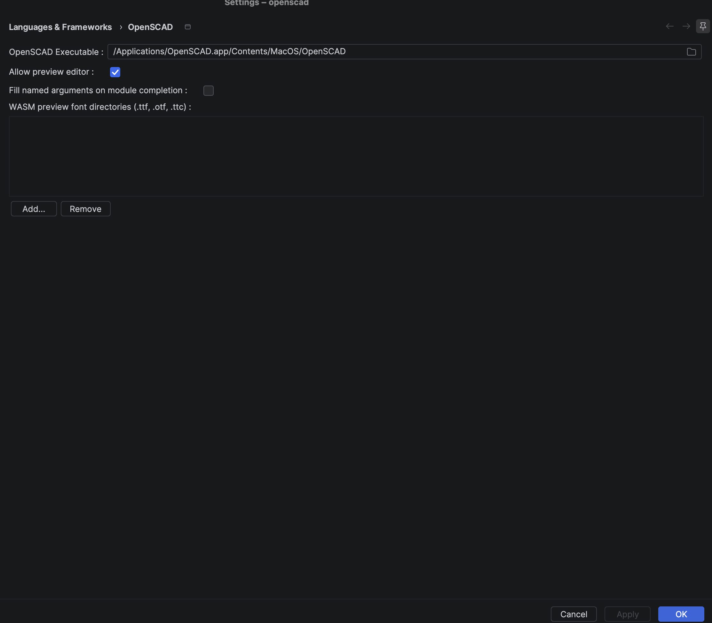
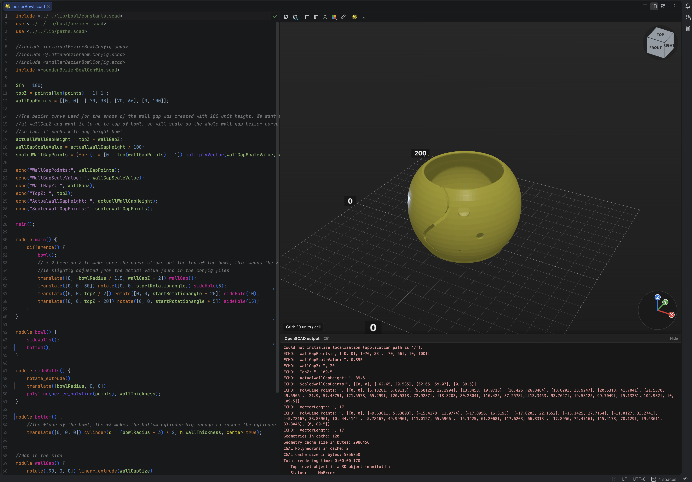
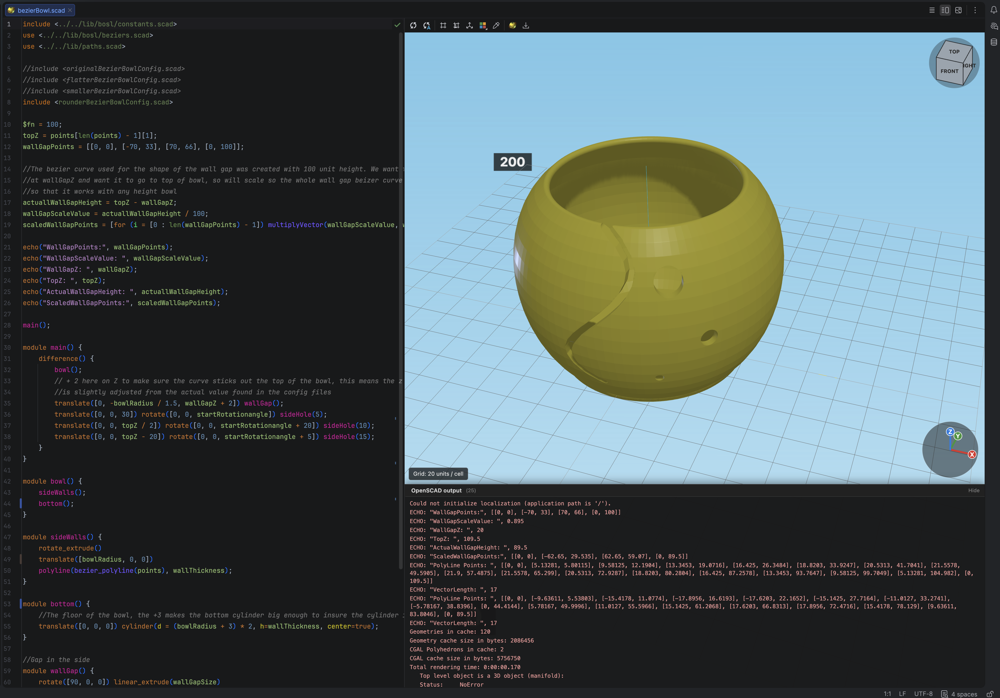
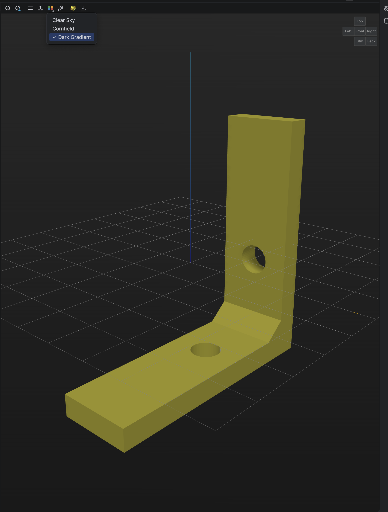
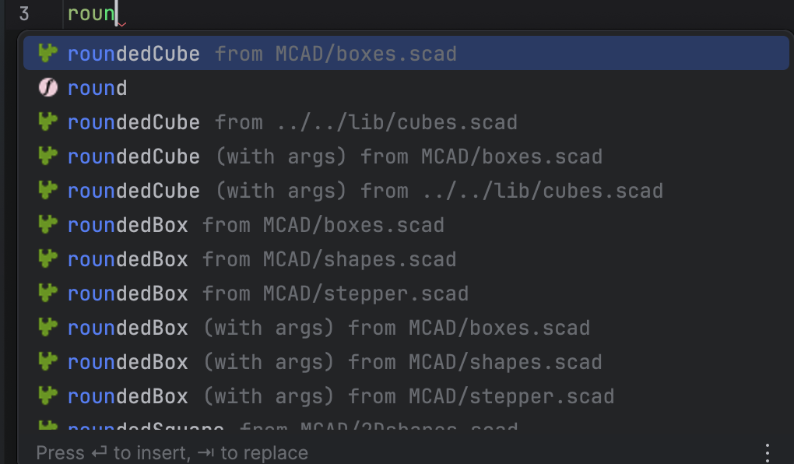
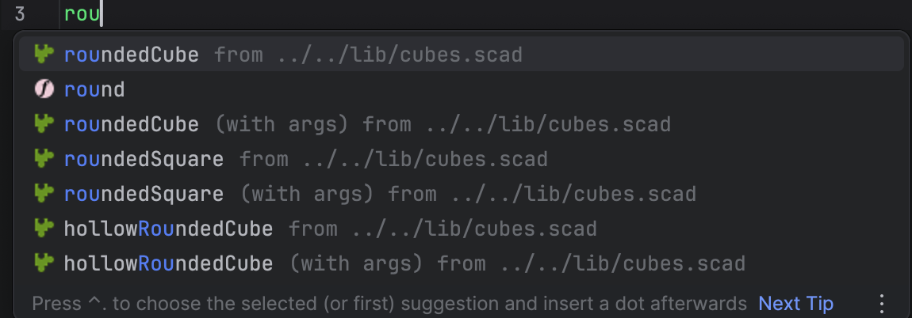
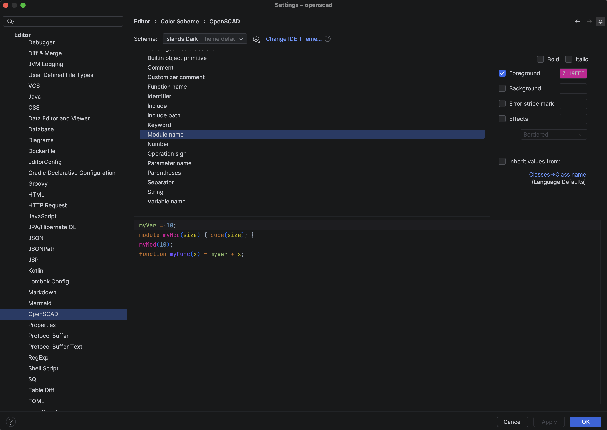

<!-- Plugin description -->
# OpenSCAD Support

[OpenSCAD](https://openscad.org/index.html) language support for IntelliJ Platform IDEs (IntelliJ IDEA, PyCharm, and others).

* **Live 3D preview** in a split editor, renders in the IDE with no OpenSCAD install required
* **Auto-refresh on save** (optional), plus manual refresh from the preview toolbar or context menu
* **Preview toolbar**, scene background, grid, axes, and model color
* **Preview feedback**, status overlay while rendering; collapsible output panel for `echo`, warnings, and errors
* **Syntax highlighting** with a customizable color scheme
* **Semantic highlighting** for modules, functions, variables, and parameters
* **Completion** for language keywords, built-in modules and functions, project symbols, and `use` / `include` files
* **Library completion** for installed OpenSCAD libraries (invoke with Ctrl+Space)
* **Navigate and rename** modules, functions, and variables, including across files
* **Unresolved reference** inspection for unknown symbols
* **Code formatting**, folding, and structure view
* **Live templates** for common OpenSCAD patterns
* **Color picker** for color values in code
* **Open in OpenSCAD** and **Export as…** from the editor context menu (requires a local OpenSCAD install)
<!-- Plugin description end -->

# Fork

This is a maintained fork of [ldenisey/idea-openscad](https://github.com/ldenisey/idea-openscad) by Lucien Denisey. The original plugin on JetBrains Marketplace (`com.javampire.idea-openscad`) is no longer actively maintained.
This fork uses plugin ID `com.mjparme.idea-openscad` and is published separately.

# Configuration

## OpenSCAD executable

Preview rendering uses **openscad-wasm** bundled in the plugin, you do not need a native OpenSCAD install to use the split preview editor.

A native [OpenSCAD](https://openscad.org/downloads.html) executable is only required for **Open in OpenSCAD** and **Export as…** (context menu actions). The plugin searches standard installation paths at startup.

Go in *Settings* -> *Languages & Frameworks* -> *OpenSCAD* to set the executable path and activate or deactivate the preview editor.



On macOS, the default install location is usually:

```text
/Applications/OpenSCAD.app/Contents/MacOS/OpenSCAD
```

(MacPorts installs may use `/Applications/MacPorts/OpenSCAD.app/Contents/MacOS/OpenSCAD` instead.)

# Features

## Preview panel

The split preview editor lets you edit `.scad` files and see the result in the IDE without launching native OpenSCAD. Rendering runs **openscad-wasm** (Manifold backend) in a JCEF Web Worker; project `use` / `include` dependencies are bundled into a virtual filesystem for the WASM runtime.

You can manually refresh the preview by clicking on the  button in the preview panel or in the editor context menu.
Alternatively, you can activate the auto refresh with the button  which refresh the preview at every file save.
If your model is complex you can temporarily lower the [$fn variable](https://en.wikibooks.org/wiki/OpenSCAD_User_Manual/Other_Language_Features#.24fa.2C_.24fs_and_.24fn) to speed up the preview generation.



When openscad-wasm prints output, `echo`, warnings, or errors, it appears in the **OpenSCAD output** panel at the bottom of the preview. Click the panel header to show or hide it; it auto-expands on warnings and errors.



Use the **Background** toolbar dropdown to choose a scene background. **Dark Gradient** (default), **Clear Sky**, and **Cornfield** use colors from the matching OpenSCAD render color schemes.



## Code completion

Completion behavior depends on where symbols come from:

* **Built-in OpenSCAD modules and functions** (e.g. `cube`, `translate`, `union`), included when you type or invoke completion normally.
* **Symbols from `use` and `include` in your project**, included automatically, with tail text showing the source file.
* **Modules and functions from OpenSCAD global library paths**, **not** shown in the automatic completion popup. Press **Ctrl+Space** (or your IDE’s *Code Completion* shortcut) explicitly to load them. Scanning every `.scad` file under library paths is deferred for performance; the completion list may show a hint to press the shortcut for global libraries.

After an explicit completion invoke, modules from library folders (e.g. MCAD) appear with the library path in tail text:



Module completion can insert parentheses and optionally fill named arguments with defaults (*Settings* -> *Languages & Frameworks* -> *OpenSCAD*, see below).

## Module completion

*Settings* -> *Languages & Frameworks* -> *OpenSCAD* -> **Fill named arguments on module completion**

| Setting | Completion list | On accept |
|--------|------------------|-----------|
| **Off** (default) | Each module with parameters appears twice: `myModule` and `myModule (with args)` | `myModule` inserts `myModule()` (or `myModule(arg = default)` for positional-first builtins). Choose `(with args)` to insert a filled call with named arguments and defaults. |
| **On** | Only one entry per module (no `(with args)` variant) | Always inserts a filled call, parentheses plus named arguments, using default values when the module defines them. |

With **Fill named arguments on module completion** off, modules from a `use` file show both entries (tail text indicates the source file):



Applies to built-in modules, project modules, and modules from `use` / `include` / global libraries.

## Global libraries

OpenSCAD library paths configured in OpenSCAD are added as IDE libraries at startup.
You can navigate to symbols in those libraries and complete them after an explicit **Ctrl+Space** (see *Code completion* above).

Project `use` / `include` files are resolved separately and appear in completion without that extra step.

## Formatting

The formatting options are located in *Settings* -> *Editor* -> *Code Style* -> *OpenSCAD*.

## OpenSCAD color scheme

The OpenSCAD color scheme can be loaded in *Settings* -> *Editor* -> *Color Scheme* -> *OpenSCAD* -> *Scheme* -> *OpenSCAD.Default*.



## Shortcuts

You can add shortcuts in *Settings* -> *Keymap* -> *Plugins* -> *OpenSCAD Support*.

## Context menu

When editing a `.scad` file, right-click in the editor or on the editor tab and open the **OpenSCAD** submenu:

* **Open in OpenSCAD**, launch OpenSCAD with this file (requires a configured executable)
* **Export as…**, export via the OpenSCAD command line (requires a configured executable)
* **Refresh Preview**, re-render the WASM preview (only when the split preview editor is open; no native OpenSCAD required)

# Known issues

## Text and `textmetrics()` in preview

WASM preview has no access to system fonts. When bundled sources use the `text()` module or the experimental [`textmetrics()`](https://github.com/openscad/openscad/wiki/Experimental-Features) / `fontmetrics()` builtins, the preview lazy-loads the openscad-wasm **Liberation** font bundle (~8 MB). Models that only use primitives skip that download.

Configure **WASM preview font directories** in **Settings → Languages & Frameworks → OpenSCAD** to add `.ttf`, `.otf`, and `.ttc` files from your machine. Configured folders are scanned recursively; each font file is mounted in the WASM filesystem as `/fonts/{filename}` (basename only). The Liberation bundle is still loaded when text is used; user fonts are added alongside it (64 MB total cap).

**Font names:** Preview does not use your OS fontconfig aliases. Native OpenSCAD may map names like `Arial` or `sans-serif` through system config; WASM preview only knows the **family name stored inside each font file** (plus the bundled Liberation families). Use the real family name in `text()` — inspect the font in Font Book, `fc-scan`, or similar if `font = "MyFont.ttf"` does not match. Names from the macOS font menu are not always the same as the internal family name.

**Duplicate filenames:** If two configured directories contain the same basename (e.g. `Regular.ttf` in different families), only one file is mounted and the last one scanned wins. Rename files or consolidate directories to avoid silent collisions.

For full fontconfig behavior, use **Open in OpenSCAD**.

# Issues and requests

Issues and requests are tracked in the [Issues tab](https://github.com/mjparme/idea-openscad/issues).
